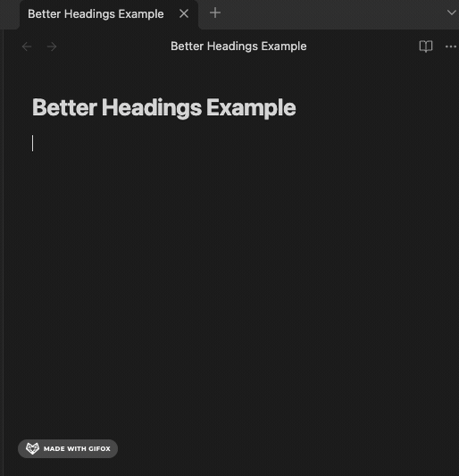

# Better Headings

## Description

Better Headings makes your headings better by automatically prefixing them with
a decimal style numbered heading. More features are planned, but the immediate
goal is to make it simpler to number your headings.

## Installation

Install via the Obsidian community plugins panel.

## Recommendations

Use the default settings when working with this plugin.

## Feedback

Feedback is welcomed. Please file an issue or feature request.
